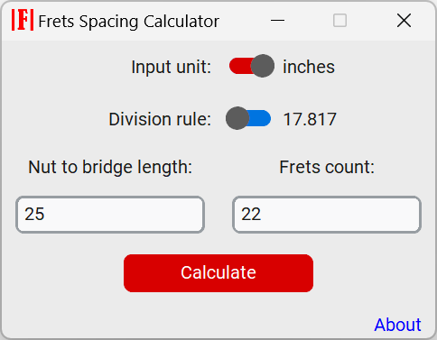
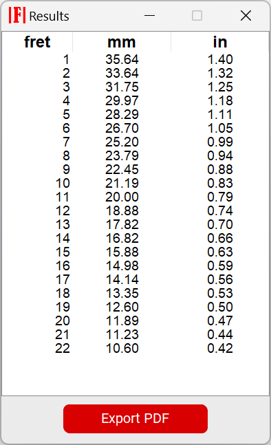

A frets sizes calculator

---
**Description:**

A simple program in Python to calculate frets sizes in string instruments, especially suited for guitars.

---

**About:**

Guitar luthiers commonly employ a division rule using the 12th root of 2
(approximately 17.817) to calculate fret measurements.

This division is applied iteratively for each fret, determining the distance
between successive frets on the instrument's scale.

Following this rule, at the 12th fret (half the scale) the string will
resonate at double the frequency of the open string, which should
provide a fair amount of pitch precision along the scale.

A rule of division by 18 is also often used, therefore this option is provided in this program as well.

---
**Screenshots:**

---
**Requirements:**

-Python 3.11+

`pip install customtkinter`

`pip install fpdf2`

---
**Installation / Run:**

Option 1:

- Install the requirements
- From the programs' path run `python frets.py`

Option 2 (Windows only):

- Unzip the installer and run _Frets_Installer.exe_
- Follow the Wizard :mage_man:
- Run the program in admin mode to be able to export PDFs

---
**License:**

Frets is licenced under MIT License

---
**Changelog:**

- Aug 1, 2023: Created
- Aug 28, 2023: Published first working GUI
- Sep 2, 2023:
    - Added numeric inputs filters
    - Added an export to PDF function
    - Added a quit confirmation window
    - Added an "about" hyperlink to this page
    - Fixed a few bugs